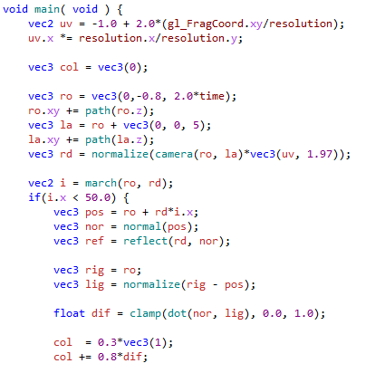

# GLSL Language Service for Visual Studio

<!-- Update the VS Gallery link after you upload the VSIX-->
Download this extension from the [VS Gallery](https://visualstudiogallery.msdn.microsoft.com/[GuidFromGallery])

See the [changelog](CHANGELOG.md) for changes and roadmap.

---

## Features

- Syntax highlighting
 - Semantic highlighting
- Intellisense
 - Statement completion
 - Quick info
 - Signature help
- Real-time syntax errors.
- Other
 - Outlining
 - Brace completion
 - Brace matching
 - Smart indention

### Syntax highlighting
Full Syntax and semantic coloring.

Coloring is fully customizable from the Fonts and Colors options page.

### Intellisense
#### Statement Completion
Gives suggestions as you type or using the standard keyboard shortcuts.

#### Quick Info
Hover over any identifier to see more info about it.

#### Signature Help
Displays what the parameters to the function are as you type.

### Real-time Syntax Errors
Syntax errors automatically show up in the editor and the Error List.

### Other
#### Outlining
Makes functions and other languages structures collapsible.

#### Brace Completion
Automatically inserts the closing brace.

#### Brace Matching
Highlights the brace that matches the one under the cursor.

#### Smart Indention
Automatically indents the cursor to the correct indention level.

## Contribute
Check out the [contribution guidelines](CONTRIBUTING.md)
if you want to contribute to this project.

For cloning and building this project yourself, make sure
to install the
[Extensibility Tools 2015](https://visualstudiogallery.msdn.microsoft.com/ab39a092-1343-46e2-b0f1-6a3f91155aa6)
extension for Visual Studio which enables some features
used by this project.

## License
[Apache 2.0](LICENSE)